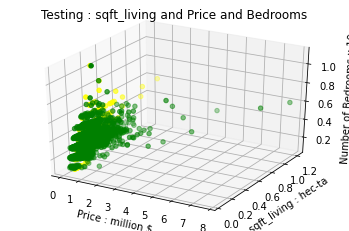
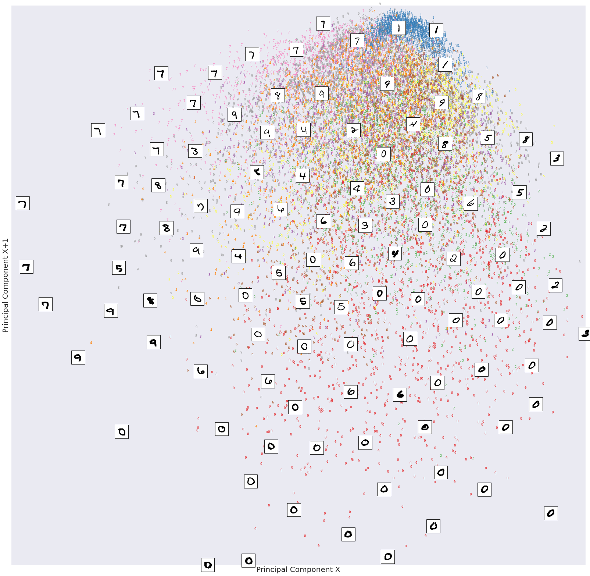

# Portfolio
---
## Computer Vision

### Facial Expression Recognition using Deep Learning	

My complete implementation of assignments and projects in ***AIP391: AI Programming Project*** by FPTU (Summer 2022).

**Facial expression recognition(FER):** is the task of classifying the expressions on face images into various categories such as anger, fear, surprise, sadness, happiness and so on. FER is significant for human-computer interaction such as clinical practice and behavioral description.In this work, we propose a lightweight deep learning model based on VGGnet. The model used achieved an accuracy of 72% on the test data. The realtime analyzer assigns a suitable emoji for the current emotion.

**Real-time Human Emotion Recognition** From facial expressions. It uses a lightweight deep Convolutional Neural Network. The model is highly efficient, and with small size, that can be deployed on devices equipped with limited computational resources. 

**VGG** stands for Visual Geometry Group; it is a standard deep Convolutional Neural Network (CNN) architecture with multiple layers. The “deep” refers to the number of layers with VGG-16 or VGG-19 consisting of 16 and 19 convolutional layers.

**The VGG architecture** is the basis of ground-breaking object recognition models. Developed as a deep neural network, the VGGNet also surpasses baselines on many tasks and datasets beyond ImageNet. Moreover, it is now still one of the most popular image recognition architectures.

 

 

---
### Squat counter & angle estimation using OpenCv and Mediapipe	

A simple program using Mediapipe and OpenCV to count the number of Squat done and detect the crucial angles in Squat position. The main goal is to ensure proper form while doing Squat so as to achieve maximum effect. You may use the SquatCounter_Realtime in projects, changing the variables as necessary.

 

 
---

## Data Science

### House predict using Linear Regression & Gradient Descent

The purpose of the project is to predict the market value of the property being sold. This program helps to find the starting price of a location based on location variables. Similarly, consider a situation in which a person needs to sell a house. By using a real estate pricing system, the seller will be able to determine what features he can add to the house so that the house can be sold at a higher price. Therefore, in both cases, we can be sure that the home price is good for both the buyer and the seller. Housing prices go up every year, so there is a need for a real estate forecasting system. Estimating the price of a house can help a developer determine the selling price of a house and can help clients set a reasonable time to buy a home.

 

 

**Linear regression analysis** is used to predict the value of a variable based on the value of another variable. The variable you want to predict is called the dependent variable. The variable you are using to predict the other variable's value is called the independent variable.

**Gradient descent (GD)** is an iterative first-order optimisation algorithm used to find a local minimum/maximum of a given function. This method is commonly used in machine learning (ML) and deep learning(DL) to minimise a cost/loss function (e.g. in a linear regression)

---
### MNIST Digits classification using PCA, SVM

As in today’s digital world optical character recognition technologies, use of auto-matic system for character recognition in physical document has increased. Andmany of the technologies are insufficient for recognition and classify them correctlydue to different styles and handwritings. The main aim of a paper is to provide imple-mentation of classification algorithms to recognize handwritten digits, i.e., 0–9. Thescope includes the elementary study of combination methods of different classifiersand calculates their performance on the basis of problem of handwritten digit recog-nition. Here, we are implementing PCA and SVM to recognize handwritten digit. This method able to reach accuracy rate of <b>92.71 %</b>.

 

 

**Principal component analysis (PCA)** is a technique that transforms high-dimensions data into lower-dimensions while retaining as much information as possible.

**Support Vector Machine (SVM)** is a supervised machine learning algorithm that can be used for both classification or regression challenges

---

© 2022 Thanh Dam. Powered by Jekyll and the Minimal Theme.

